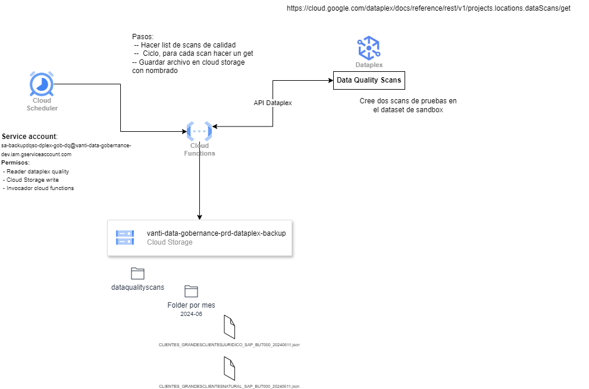

# Backup Scans Calidad

Implementación de una Cloud Function para realizar copias de seguridad de Dataplex a Cloud Storage.

Este documento describe el proceso para implementar una Cloud Function llamada "cf-dataplex-dataquality-scans-backup" en Google Cloud Platform (GCP), este proceso consiste en disparar a las 23:00 horas cada día mediante Cloud Scheduler una cloud function. La función realiza una copia de seguridad de los análisis de calidad de datos y de perfilamiento de Dataplex en un bucket de Cloud Storage denominado "vanti-data-gobernance-prd-dataplex-backup".

## Arquitectura

La arquitectura del sistema se compone de los siguientes elementos:

Cloud Scheduler: Programa la ejecución de la Cloud Function a las 23:00 horas cada día.
Cloud Function: Implementa la lógica para realizar la copia de seguridad de los análisis de Dataplex.
Dataplex API: Proporciona acceso a los datos de Dataplex para realizar la copia de seguridad.
Cloud Storage: Almacena las copias de seguridad de los análisis.

